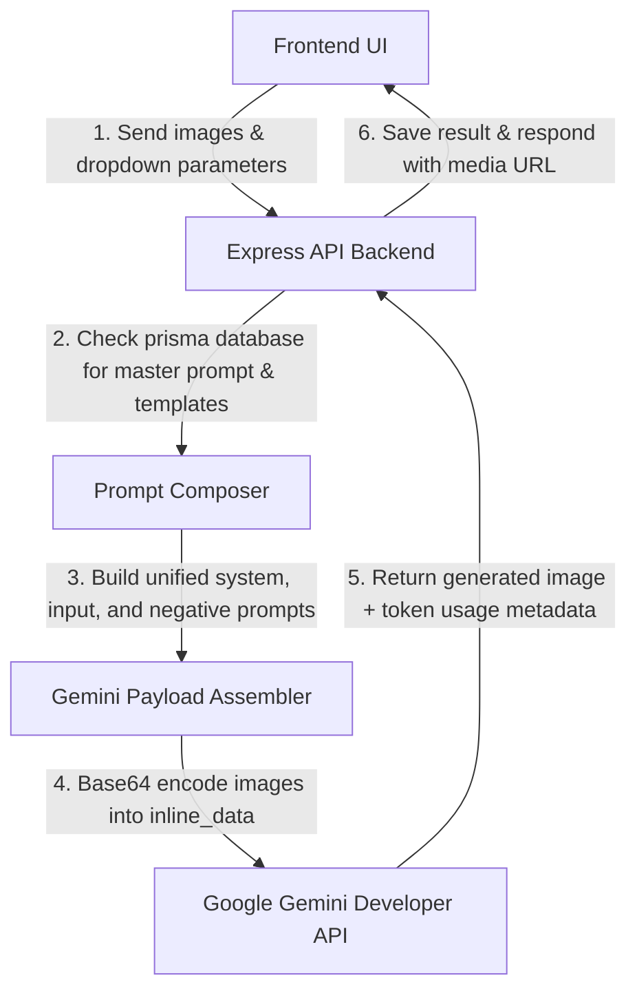

# Jewel AI Studio — Application Architecture & Prompt Guide

This document explains the core mechanics of how the Jewel AI Studio handles image generation, multi-piece jewelry, user dropdown variables, and API request payloads.

---

## 1. How the App Works Under the Hood



1. **Multimodal API Calls**: Unlike standard text-to-image generators, Jewel AI uses **Gemini 3.1 Pro/Flash** in a **multimodal** configuration. 
2. **Context Inputs**: The API receives the composed text prompt *together* with the raw input images (product image, reference/model image) in a single request. Gemini uses the images as spatial and visual grounding guides, preserving the physical geometry while redrawing backgrounds, reflections, or models.

---

## 2. Handling Images with Multiple Jewelry Items
*(e.g., stacks of rings, necklace + earring sets, matching wedding bands)*

* **Selection**: The user select **"Multiple Items"** in the **Piece Type** dropdown.
* **AI Processing**: Gemini’s vision-encoder automatically parses and segment-masks all physical jewelry elements in the input picture.
* **Preservation**: The model handles them collectively as a single group. It aligns perspective, light source highlights, and cast shadows across all detected pieces, ensuring they are treated as a unified set with identical physical characteristics.

---

## 3. The Role of Dropdown Selections & How They Reflect in the Prompt

The dropdown selections serve to programmatically customize the generated image's environment, material reflection properties, and photographic quality.

Depending on the backend state, these selections are mapped into the final prompt in three ways:

### A. Structured Fallback Mode (No Custom Master Prompt)
If no custom template is active, the backend converts all dropdown values into a highly structured, clean key-value block:
```text
SYSTEM:
[Master System Prompt defining jewelry photography guidelines...]

TASK:
Perform the Catalog Image workflow while maintaining absolute fidelity.

STRUCTURED INPUTS:
Subject: Ring
Material: 18k Yellow Gold, mirror-polished finish
Gemstone: Sapphire, physically accurate refraction
Environment: Marble seamless background
Lighting: Cinematic Luxury, professional studio setup
Custom instruction: Add subtle Diwali sparks...

OUTPUT REQUIREMENTS:
- STRICT FIDELITY: Do not alter the actual design, proportions, or metalwork...
```

### B. Master Template Mode (Active Custom Prompt)
If a master template is defined by the Admin (e.g. **Catalog Image Master**), the backend merges the database's specific system guidelines, camera parameters, environment guidelines, and lighting formulas, appending the user's custom instructions to enforce rules like material and gemstone consistency.

### C. Default Fallback Formula (Contextual Substitution)
For specific workflows (such as **Jewelry On Model** or **Gemstone Color Change**), the dropdown choices are interpolated directly into descriptive sentences:
* *Model Try-On*: `"A wheatish female model wearing the **18k Yellow Gold** **Ring** set with **Diamonds**."`
* *Color Change*: `"Identify the gemstones. Replace their appearance with **Ruby Red** gemstones of the same cut and size."`

---

## 4. API Request Payload Structure

When communicating with the Gemini API, the backend makes an HTTP POST request to:
`https://generativelanguage.googleapis.com/v1beta/models/{modelName}:generateContent`

### JSON Request Schema:
```json
{
  "contents": [
    {
      "role": "user",
      "parts": [
        {
          "text": "[Composed Prompt incorporating system directives, dropdowns, and custom instructions]"
        },
        {
          "inline_data": {
            "mime_type": "image/png",
            "data": "iVBORw0KGgoAAA..." 
          }
        },
        {
          "inline_data": {
            "mime_type": "image/jpeg",
            "data": "/9j/4AAQSkZJRg..." 
          }
        }
      ]
    }
  ],
  "generationConfig": {
    "responseModalities": ["IMAGE", "TEXT"]
  }
}
```

* **Text Part**: Contains the fully composed text prompt detailing exactly what to do, what to preserve, and what to avoid (negative prompt).
* **Inline Data Parts**: The backend loads local product and reference images from `/uploads`, converts them to **Base64 binary**, and appends them inside the `parts` array so the model can visually process and modify them.
