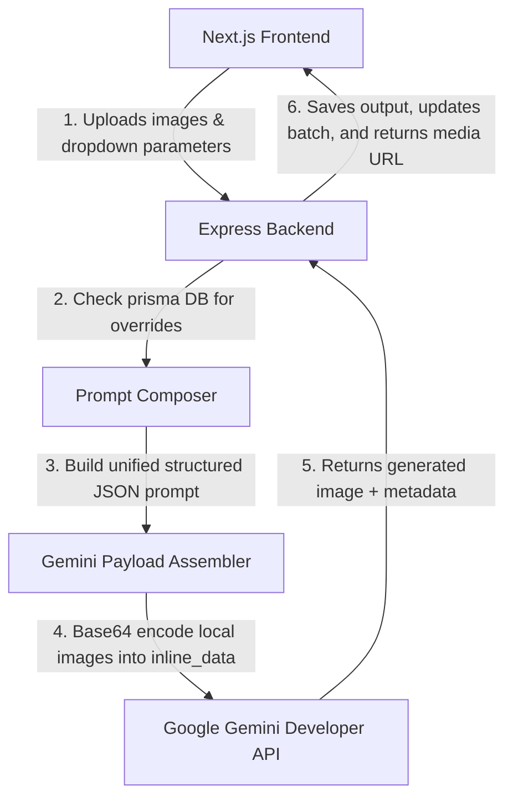

# Jewel AI Studio — Comprehensive Codebase Analysis

This document provides a highly detailed, professional-grade architectural overview and technical analysis of the **Jewel AI Studio (v2)** project. Jewel AI Studio is a Dockerless full-stack web application running a Next.js (App Router) frontend, a TypeScript/Express backend, SQLite for database storage (managed by Prisma ORM), and the Google Gemini & Imagen API suites for advanced multimodal jewelry photography generations and live market precious metal spot rate analysis.

---

## 1. Directory Structure

The repository is structured as a monorepo with an unified entry point at the root level and separate, clean modules for the backend API and frontend Next.js interface:

```text
Jewel AI/
├── backend/                  # Express + TypeScript Backend
│   ├── prisma/               # SQLite database & Prisma schema
│   │   ├── dev.db            # SQLite database file
│   │   └── schema.prisma     # Database schema definition
│   ├── src/                  # Backend Source Code
│   │   ├── index.ts          # Express Router and server entry point
│   │   ├── logger.ts         # Winston-style application logging
│   │   ├── prisma.ts         # Prisma client instantiation
│   │   ├── prompts.ts        # Modular master & child prompt library defaults
│   │   └── queue.ts          # Dockerless in-memory queue & Gemini API integrations
│   ├── package.json          # Node dependencies for Backend
│   └── tsconfig.json         # TypeScript compiler configurations
├── frontend/                 # Next.js 16 (React 19) + Tailwind CSS 4 Frontend
│   ├── src/                  # Frontend Source Code
│   │   ├── app/              # App Router Pages
│   │   │   ├── admin/        # Admin configurations panel (/admin)
│   │   │   │   └── page.tsx  # Metrics, prompts template, playground, spot rates
│   │   │   ├── history/      # History gallery panel (/history)
│   │   │   │   └── page.tsx  # Completed generations, Load Studio, download
│   │   │   ├── globals.css   # Main styles and custom theme parameters
│   │   │   ├── layout.tsx    # App root viewport skeleton
│   │   │   └── page.tsx      # Core studio workspace (/ - split canvas, parameters)
│   │   ├── components/       # Shared UI components
│   │   │   ├── SettingsModal.tsx # Global API Settings dialog
│   │   │   └── ui/           # Custom Shadcn core elements (dialog, button, card)
│   │   └── lib/              # State & Services
│   │       ├── api.ts        # Axios server client utilities
│   │       └── store.ts      # Zustand state client
│   └── package.json          # Node dependencies for Frontend
├── docs/                     # Product requirements & developer guides
├── package.json              # Monorepo task configurations
├── start.js / server.js      # Server boots and monorepo running engines
└── run.bat                   # Desktop boot shortcut
```

---

## 2. Under-the-Hood Architecture & Dataflows

Jewel AI Studio leverages **Gemini 2.x/3.x multimodal models** as spatial and visual grounding guides, preserving the physical geometry of uploaded jewelry while redrawing backgrounds, reflections, or models:



---

## 3. Database Schema (`schema.prisma`)

The database is built on **SQLite** for instant desktop deployments without external database dependencies. The core database tables and their relationship diagrams include:

* **User & Team**: Supports basic authentication, organizational credits management, and white-labeling rules for enterprise custom brands.
* **Project & Batch**: Logical clustering of jewelry jobs. Projects contain single generations, while Batches hold bulk operations (up to 30 products) for parallel asynchronous rendering.
* **Asset**: Stores original uploaded images (`/uploads/`) with descriptive categorizations.
* **Job**: The main operational ledger storing state (`PENDING`, `PROCESSING`, `COMPLETED`, `FAILED`), prompt configurations, specific jewelry parameters, metal/gemstone variants, input assets, final outputs, and credit logs.
* **StylePreset**: Stores customizable style templates (such as specific surface materials or photography themes) that append prompt addons.
* **PromptTemplate**: Overriding templates mapping system roles, camera specs, environmental rules, physics details, and preservation guidelines for each of the 8 workflows.
* **SubjectPrompt**: Specific descriptors for individual piece types (e.g., standard descriptions for rings, necklaces, watches).
* **ProviderSetting**: Stores secure provider credentials, encryption rules, API keys, and model names.
* **RateEntry**: Manual localized precious metal spot values and diamond price structures.

---

## 4. Backend Engine Analysis

### A. The Prompt Engine (`prompts.ts` & `queue.ts`)
The prompt synthesizer (`composePrompt`) builds a rich, production-grade prompt system:
1. **Inheritance & DB Override**: It fetches the workflow configuration. If an administrative override exists in the `PromptTemplate` table, it takes priority; otherwise, it falls back to the hardcoded library defaults inside `prompts.ts`.
2. **Dynamic Subject Maps**: It splits comma-separated piece types (e.g., `"Ring, Necklace"`), loads their specific core anatomy descriptions, and constructs a subject-specific map. If multiple types are chosen, it automatically appends a cohesive group-arrangement description (`multiple_items`).
3. **Structured JSON Assembly**: Rather than sending unformatted text, it constructs a professional prompt document:
   ```json
   {
     "generation_profile": {
       "intent": "commercial_catalog_composite",
       "target_aesthetic": "photorealistic_luxury"
     },
     "prompt_components": {
       "system_role": "Act as a master commercial product photographer...",
       "camera_settings": "High-end macro product photography, shot on a 100mm...",
       "subject": {
         "ring": "A luxury ring positioned elegantly...",
         "multiple_items": "A curated luxury jewelry set arranged..."
       },
       "environment": "Placed gracefully on a premium, soft cream-colored velvet...",
       "lighting_and_physics": "Soft, diffused Profoto studio lighting..."
     },
     "negative_prompt": "3d render, CGI, digital illustration..."
   }
   ```

### B. Gemini API Integration (`queue.ts`)
* **Dockerless Asynchronous Processing**: By replacing the memory-heavy redis-backed `BullMQ` engine with native asynchronous runtime operations (`setImmediate` + in-memory task runner), the application runs at lightning-speed in a "zero-containers" desktop setting.
* **SDK Multimodal Callers**: Incorporates the official `@google/genai` (v2.4.0) library:
  * For **Imagen** models (`imagen-` prefix), it routes to `ai.models.generateImages` to perform text-to-image conversions under custom aspect ratios.
  * For **Gemini** models, it performs multimodal conversions. It processes locally uploaded paths, converts them to base64 `inlineData` parts, and sends them alongside the compiled JSON prompt to `ai.models.generateContent` with `responseModalities: ["IMAGE", "TEXT"]` configuration.
  * **Fallback System**: If the SDK generator encounters network failures or credential blocks, it automatically falls back to an native HTTPS REST handler (`callGeminiImageViaRest`) targeting standard API endpoints.

### C. Server Routes (`index.ts`)
* **Automated Seeding**: When the Express server boots, `seedDefaults()` automatically inserts high-end prompts, jewelry types, and model settings to populate a fresh database.
* **API Key Encryption**: Protects external developer tokens safely.
* **Yahoo Finance Precious Metals Rates**: Under `/api/rates/live`, it pulls real-time gold (`GC=F`), silver (`SI=F`), and platinum (`PL=F`) market rates, alongside USD-PKR exchange ratios (`USDPKR=X`). It programmatically calculates prices per troy ounce, gram, and tola (11.6638g) in both USD and local currency (PKR).

---

## 5. Next.js Frontend Interface

### A. The Studio Workspace (`/` page.tsx)
The primary workspace represents a premium design featuring glassmorphic shadows, vivid gradients, and smooth transition animations:
* **Workflow Sidebar (Left)**: Instantly swaps between the 8 production workflows, adjusting UI prompts and media requirements. It also showcases active job counts and real-time generation queues.
* **Dynamic Split Canvas (Center)**: Features drag-and-drop zones for catalog items, references, and customer portraits on the left. The processed studio output renders on the right with full downloading, regenerate, and dashboard favoriting capabilities.
* **Stretched Instruction Bar**: A prominent text box allows writing natural language modifications on top of the presets.
* **Generations Carousels (Bottom)**: Stores historical uploads and active renders in smooth horizontal scroll components.
* **Parameter Sidebar (Right)**: Implements custom multi-select dropdowns for piece types, alongside API models, aspect ratios, and safe person generation configurations.

### B. The Admin Dashboard (`/admin` page.tsx)
An absolute utility panel structured into six functional tabs:
1. **Overview**: Success rate progress graphs, job metrics (completed, failed, favorites), and server health indicators.
2. **API Settings**: Configures model selections and securely modifies developer API keys.
3. **Prompts & Subjects**: A complete CRUD editor to write new workflows or adjust core anatomical rules.
4. **Prompt Test**: A simulated developer playground showing how variables compile into the final JSON document, with single-click copy to clipboard triggers.
5. **Spot Rates**: Custom tables for manual appraising values.
6. **Quality Control**: Live-monitoring panel showing recent job failures and quick-links to load problematic assets directly in the workspace.

### C. Studio History Gallery (`/history` page.tsx)
* Displays a grid of completed renders with instant "Load Studio" hooks.
* Hover animations show specific metadata including workflow category, project descriptions, jewelry types, and generation dates.

---

## 6. Development Strengths & Modern Patterns

1. **Pixel-Perfect Fidelity Lock**: Hardcoded structural guidelines protect fine elements (e.g., gemstone facets, thin prongs, band shapes) from warping or melting.
2. **Unified JSON Prompts**: Consolidates separate prompts under a single master schema to enforce extreme styling consistency.
3. **Dockerless Lightweight Framework**: Easily deployable on local desktop workstations with standard SQLite, replacing containerized services like Redis and BullMQ with in-memory execution hooks.
4. **Yahoo Finance Spot Rates Feed**: Bridges AI generation with real commodity values, offering premium local appraisals.
